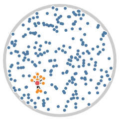

# msh examples

**Work in progress!**

This repository contains examples of usage of various [msh libraries](https://github.com/mhalber/msh)

Examples so far:

- [Spatial Hash Grid](#spatial-hash-grid)
- [Ply Loading](#ply-loading)
- [PDF Sampling](#pdf-sampling)

## Spatial Hash Grid

**Library:** msh_hash_grid.h

**Compilation:**
~~~
gcc -std=c99 -I<path_to_msh_libraries> msh_hash_grid_example.c -o msh_hash_grid_example -lglfw3 -lopengl32 -lglew32 -lnanovg
~~~
  
**Usage:**
~~~
./msh_hash_grid_example
~~~

This program showcases the usage of msh_hash_grid.h. It creates a window in which we visualize neighbors of a moving 2D point. Requires OpenGL, GLFW, GLEW and nanovg to build.

## Ply Loading

**Library:** msh_ply.h

**Compilation:**
~~~
gcc -std=c99 -I<path_to_msh_libraries> msh_ply_example.c -o msh_ply_example
~~~
  
**Usage:**
~~~
./msh_ply_example <path_to_ply_file>
~~~

Simple program showcasing msh_ply.h for writing ply file of a colored cube mesh. Program will also read the file back and print the contents of a ply header into stdout.

## PDF Sampling

**Library:** msh_std.h

**Compilation:**
~~~
gcc -std=c99 -I<path_to_msh_libraries> msh_ply_example.c -o msh_ply_example
~~~
  
**Usage:**
~~~
./msh_pdf_sampling_example
~~~

This program showcases different ways in which it is possible to sample discrete distributions using msh libraries. The problem we try to tackle is essentially simulating a loaded dice - given set of weights describing likelihood of rolling specific side of a dice we wish to obtain a random index that follows the same distribution as our likelihoods. This extends to an ability to sample from a discrete probability distribution.

msh_std.h implements three ways to do this:

1) Linear search - requires no setup, other than normalizing the distribution. Generating the random sample from a distribution can take O(n) time. Use only for very small distributions.

2) Inverted CDF - Works by computing an approximation of inverted cumulative distribution function. Setup takes O(m) time, where m is discretization of probabilities. Sampling takes O(1) time. Issue with this method is the discretization of probabilities to integers. Depending on your distribution m might need to be very large. To see this method fail, decrease A_INVCDF_N_BINS and inspect the printed values

3) Alias method - preferable way to do sampling. Requires O(n) setup, generation takes O(1) time (although we need to compute two random numbers instead of one). Implementation of Vose's algorithm, after [description by Keith Schwartz](http://www.keithschwarz.com/darts-dice-coins/).

This program will perform simulation of loaded dice and sampling from a mixture of 
gaussian distribution, using all three methods. Timings will also be performed.

